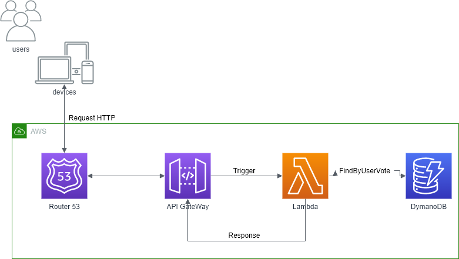
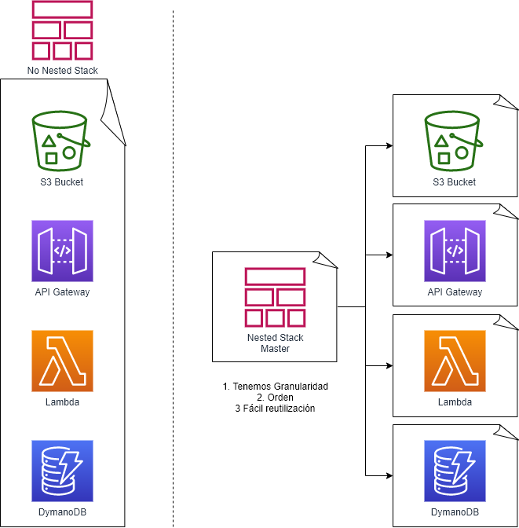

# **AWS: Infrastructure As Code: Consulta Lugar de Voto**
Project: Infrastructure as Code in AWS || Proyecto: Infraestructura como Código en AWS

# **Arquitectura**

> Arquitectura del proyecto: infraestructura como Código, en este proyecto de **@Platzi** se implementa una aplicación que permine al usuario consultar su lugar de votación

# **Puntos a tener en cuenta**
Téndras ventajas como:
- Tiempo, deplegando tu instraestructura en minutos.
- Estandarización, teniendo claro las normas antes de desplegar tu instraestructura.
- Automatización, Se ve reflezado en el tiempo y es la forma de llevar el codigo a un ambiente productivo, minimizando los errorres a travez de un flojo y un Pipeline de automatización.

## **Versionamiento**
Es una de las mayores ventajas de implementar la infraestructura como código, esto permite tener trazabilidad, saber quién solicito el cambio, quien lo hizo, cuando, cual fue el cambio y quien los aprobó.

## **Eficiencia**
Tenemos una plantilla de la infraestructura como código, que te ayuda a desplegar en un tiempo reducido, reutilizarla para crear otros ambientes o tomarlo como base.

## **Re-Utilizable**
Podemos reutilizar infraestructura que hayamos utilizado anteriormente, reutilizando la plantillza.

## **Infraestructura Inmutable**
>"No mudable, que no puede ni se puede cambiar"

No le dediquemos tiempo buscando el error en la infraestructura, volvamos a desplegar la infraestructura utilizando los flujos y Pipeline de automatización; para estar en el estado ideal.

## **Herramientas**
- Terraform - MultiCloud
- Pulimi - MultiCloud
- Serverless Framework - App sin Infraestructura
- SDK de Cada Cloud
- CDK (Cloud Developer Key) - AWS
- AWS SAM - Aplicaciones Serverless en AWS
- Cloudformation - AWS y Utilizada en este proyecto

# **Nested vs No Nested**

Podemos utilizar Nested Stack para organizar los desplieguez por recursos, esto nos permite tener mayor facilidad al momento de buscar, comprender y reutilizar los recursos.

Ejemplos:

- [**No Nested**](Nested%20vs%20No%20Nested/non-nested/master.yml)
- **Nested Stack:** [**Master**](/Nested%20vs%20No%20Nested/nested/master.yml)
  - [**Api**](/Nested%20vs%20No%20Nested/nested/api.yml)
  - [**DynamoDb**](/Nested%20vs%20No%20Nested/nested/dynamo.yml)
  - [**Lambda**](/Nested%20vs%20No%20Nested/nested/lambda.yml)
  - [**Lambda Code**](/Nested%20vs%20No%20Nested/nested/lambda-code/lambda_function.py)

